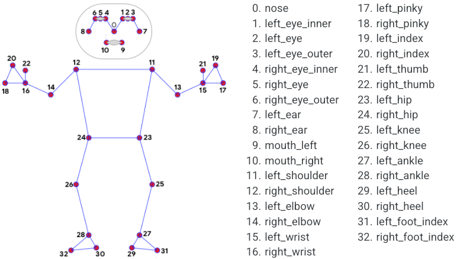

# Controlling a Robot with a Camera

This project demonstrates how to controll a robot with a camera by publishing the correct ros commands depending on user pose.

## Table of Contents

- [Project Name](#project-name)
  - [Table of Contents](#table-of-contents)
  - [Introduction](#introduction)
  - [Features](#features)
  - [Getting Started](#getting-started)
  - [Contributing](#contributing)
  - [Report](#report)

## Introduction

The purpouse of this project is to show advantages and disadvantage of using an AI approach to do this task as oppose to using the conventional approach.

## Features

This project will work with most rgb cameras to calculate user pose and thus send commands to a robot.

## Getting Started

The following will need to be installed via pip:
meadiapipe 
tensorflow
opencv
numpy
rclpy
pandas - only needed for model creation

when installed you can clone the repo and run pose_command.py or model_command.py

## Contributing

Shimon Fiddler at Middlesex university

## Report
The two main approaches addressind in this project are conventional and AI based. The conventional approach is contained in the pose_command.py file. This works by taking an image of the user via the camera (using open cv) calculating the pose (using mediapipe). Mediapipe as configured takes an image and returns a list of landmark positions in the human body. The landmarks are in the following image.

[Mediapipe documentation - Google - https://developers.google.com/mediapipe/solutions/vision/pose_landmarker]
From the list of landmarks you can use the holistic function in mediapipe to take the landmark that corrisponds to a given joint, this aids code readability. The landmarks are stored as x,y,z,visability values corrisopnding to there position in space relative to the camera. In my approach I am taking the angle between the shoulder and elbow (using the atan function) and mapping that to a range of -1 - 1. This value is then placed into a twist message that is published on the /turtle1/cmd_vel topic. This is done mapping the left arm to x - velocity and the right to z - angular.

The seccond approach uses an ai model. The data for the model was collected by datacollection.py. This program takes all the information about intrested landmarks and the guesture being performed and stores them in a file. This file currently has 1200 datapoints accross 4 classes. The file is bigdata.csv. This data is used for training the ai model in modelcreation.py. For creating the model I take all the data and load it into a pandas dataframe, this allows me to efficently manipulate it. The data is normalised by dividing all x and y values by the reciprical of z thus bringing all coordinates into the same plane. After this I drop all z collumbs significantly simplifying the input data for the model. The data is then separated into a test train split in a 60:40 ratio and the class is encoded into the trainig data. The model is then trained over 50 epochs and has a three layer architecture with dropout to prevent overfitting. This model is then saved for use in another program.